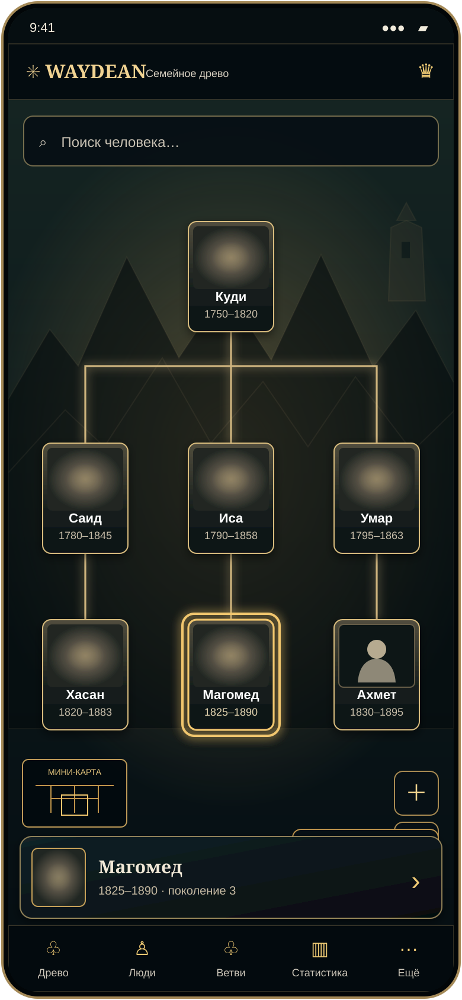

# Waydean — Mobile Master, композиция 0.1

**Статус:** черновик для визуального согласования. Выбранное направление B сохранено: дерево остаётся открытым, выбранный человек кратко показан над нижней навигацией, подробная карточка открывается отдельно.

### Что показывает макет

- Поиск находится над полотном древа.
- Выбранный человек подсвечен в дереве; краткая строка над навигацией открывает его подробный профиль.
- Мини-карта, масштабирование и кнопка «Кто я?» остаются поверх полотна.
- Для Ахмета показан нейтральный силуэт головы и плеч без черт лица.
- «Мой путь», «Моя ветвь», «Все поколения», фильтры, статистика и создание видео остаются доступны в навигации и разделе «Ещё».

Кадр: 390 × 844 CSS px. Это композиционный эскиз, а не финальная детализация: размеры, типографика, изображения и цвета будут уточняться в Mobile Master и сверяться с утверждёнными правилами дизайна.
