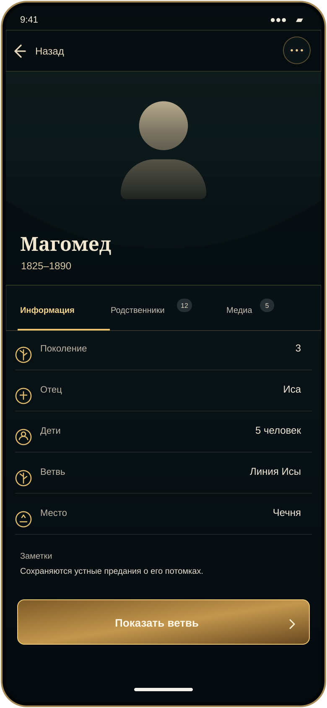

# Mobile Master — подробный профиль человека

Предложение отдельного экрана профиля для проверки следующего состояния. На него можно перейти из компактной строки выбранного человека; возврат ведёт обратно к тому же месту в дереве.

В кадре показан человек без загруженного фото, поэтому вместо портрета используется нейтральный силуэт головы и плеч без черт лица. Горный фон — утверждённый визуальный референс направления Waydean: фотореалистичный Кавказ, каменная башня, сумеречный свет и сдержанная тёплая палитра. Исходный файл: [`waydean-mobile-cinematic-background.png`](../assets/references/waydean-mobile-cinematic-background.png).

Проверять в этом состоянии нужно читаемость имени и фактов поверх изображения, ясность возврата к дереву, вкладки и заметность действия «Показать ветвь». Текущий экран остаётся черновым Master-кандидатом: следующий визуальный блок не начинается до утверждения этого экрана и screenshot review.
