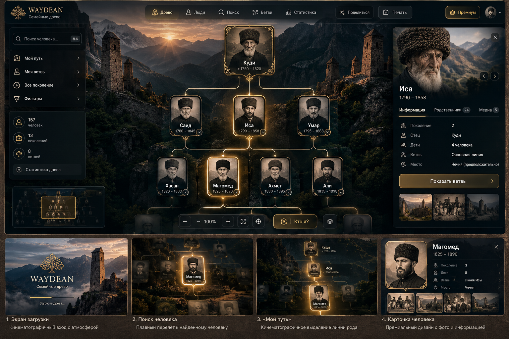
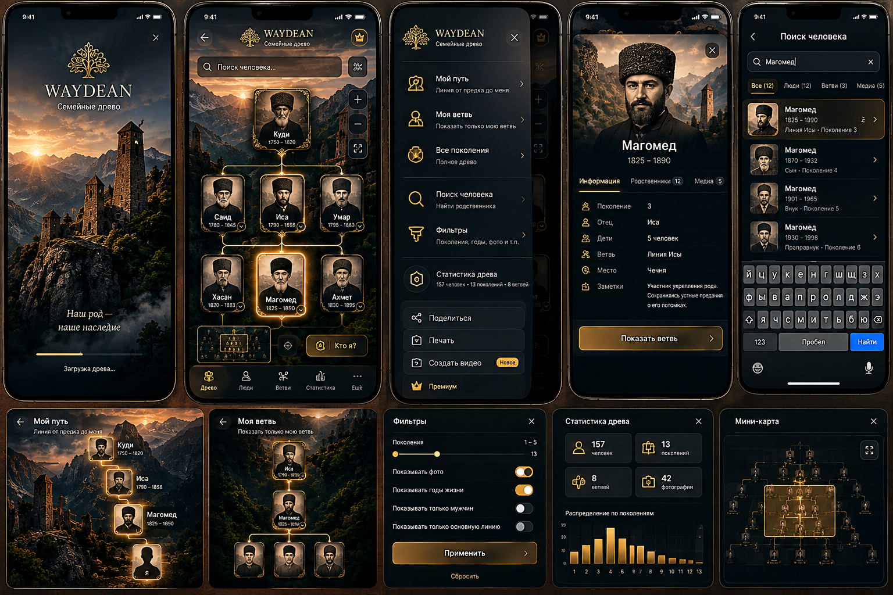

# Waydean Древо — рабочая спецификация дизайна и план качества

**Статус:** рабочая спецификация на review-ветке; production не затронут<br>
**Версия:** 1.10<br>
**Последнее обновление:** 2026-09-29<br>
**Репозиторий:** [`mansurkhatuev-coder/QuranAppWebsite`](https://github.com/mansurkhatuev-coder/QuranAppWebsite)<br>
**Раздел продукта:** `drewo/` (страница проекта — `waydean.ru/drewo/`)<br>
**Текущий шаг:** Mobile Master, Desktop Master и статические состояния приняты; локальное read-only превью проверено на 157 записях; создан первый локальный motion preview «Мой путь» на 12 фиктивных людях. Следующий шаг — визуальный review записи и кадров, затем расширение prototype и performance gate. Production не затронут.

> Этот документ объединяет решения, которые пользователь уже утвердил, и план дальнейшей проработки. Утверждённые требования считаются обязательными. Будущие детали, помеченные как направление или предложение, нужно конкретизировать в соответствующих Design Bible и Master Reference до разработки.

## 1. Назначение и главный принцип

Цель — сохранить выразительный, премиальный характер Waydean «Древо» при переходе от визуальной концепции к работающему продукту. Дизайн не должен растворяться в стандартном веб-интерфейсе, а функции не должны смешиваться между экранной анимацией, печатным экспортом и видеоэкспортом.

**Главное правило процесса:** не начинать следующий визуальный блок, пока предыдущий не совпадает с утверждённым для него Master Reference по композиции, иерархии, размерам и ключевым визуальным деталям. После реализации каждого блока делаются реальные скриншоты, проводится визуальное сравнение, исправляются расхождения и только затем открывается следующий блок.

Текущие визуализации задают арт-направление. Реализационными эталонами становятся специально подготовленные и утверждённые Desktop Master, Mobile Master и эталоны состояний компонентов.

## 1.1 Визуальные материалы из исходного чата

Оба изображения, переданные пользователем 28.09.2026, сохранены рядом с документом как утверждённые визуальные референсы этапа 1. Это коллажи экранов и состояний: они фиксируют направление и состав интерфейса, но ещё не являются точными pixel-perfect Desktop Master и Mobile Master.

### Desktop — основной экран и состояния



Зафиксированное направление: верхняя навигация и действия «Поделиться»/«Печать»; левое меню с поиском, режимами, статистикой и мини-картой; центральное древо с выделенным предком/человеком, карточками и золотыми связями; карточка человека справа; атмосферный горный фон с башнями. Нижняя полоса показывает загрузку, поиск, «Мой путь» и профиль как примеры состояний.

### Mobile — основные сценарии и состояния



Зафиксированное направление: самостоятельная мобильная композиция; экран загрузки; древо с нижней навигацией; меню действий; профиль человека; поиск с результатами; «Мой путь» и «Моя ветвь»; фильтры, статистика и мини-карта.

Лица, портреты, имена, даты и числа внутри коллажей служат демонстрацией композиции и не заменяют реальные данные проекта. Если у человека нет фото, действует отдельное обязательное правило: нейтральный силуэт головы и плеч без глаз, носа, рта и любых сгенерированных черт лица. Оригиналы сохранены без редактирования в `docs/design/waydean/assets/references/`; их статус и происхождение описаны в `README.md` этой папки.

## 2. Продуктовая граница: три независимых слоя

1. **Интерфейс и motion в самом древе.** Работа с данными, просмотром, навигацией и поиском на сайте.
2. **Печатный экспорт.** Подготовка макета для бумаги с выбором охвата, формата и разбиения на страницы.
3. **Видеоэкспорт.** Сборка отдельного ролика из заранее созданного анимационного шаблона и данных семьи.

Эти слои могут читать одни и те же данные и пользоваться общими правилами фотографий и типографики, но имеют собственные сценарии, визуальные системы и критерии качества. Видео не является записью экрана; печать не является кадром видео или скриншотом интерфейса.

### Данные и доступ для экспортов

В действующем `drewo/` просмотр требует входа, а фотографии хранятся отдельно в Supabase Storage. Перед реализацией «Поделиться», печати и видео нужно зафиксировать права на создание и просмотр результата, доступ рендера к фото, поведение QR/ссылок и срок хранения готовых файлов. Эти решения описываются в Print Design System и Video Design System; текущая спецификация не предполагает автоматической публикации семейных данных по открытой ссылке.

## 3. Этап 1 — визуальный дизайн продукта (утверждён)

Утверждено направление дизайна и набор сценариев. Это не означает, что все описанные экраны и функции уже реализованы в текущем сайте.

### 3.1 Направление

- Премиальный тёмный, кинематографичный образ.
- Древо, люди и родственные связи — главные объекты экрана; декор поддерживает историю, а не отвлекает от неё.
- Desktop и mobile проектируются как самостоятельные композиции. Мобильная версия не является уменьшенной копией desktop.
- Возможны сдержанные чеченские/вайнахские мотивы; их конкретная форма и уместность уточняются в Design Bible.
- Сохраняются реальные данные и рабочая механика проекта; визуальное улучшение не должно ломать функции древа.

### 3.2 Основной экран и функции

Предусмотреть:

- основное полотно родословного древа, карточки людей и линии родства;
- мини-карту для навигации по большому древу;
- быстрый переход «Кто я?»;
- режимы «Мой путь», «Моя ветвь» и «Все поколения»;
- поиск человека;
- фильтры, в том числе по поколению, годам и наличию фотографии;
- статистику древа: как минимум люди, поколения и ветви;
- разделы/навигацию верхнего уровня: «Древо», «Люди», «Поиск», «Ветви», «Статистика»;
- полноценную карточку/профиль человека;
- действия «Поделиться», «Печать» и «Создать видео».

На телефоне предусматривается нижняя навигация: «Древо», «Люди», «Ветви», «Статистика», «Ещё». Карточка человека на desktop располагается справа, на mobile открывается снизу, чтобы оставлять место древу. Конкретное поведение меню, переходов и панелей закрепляется в Master кадрах и Component Bible.

Для Mobile Master v0.1 принята композиция, где дерево остаётся открытым, выбранный человек выделен на полотне и кратко показан в строке над нижней навигацией. Подробный профиль открывается отдельным действием из этой строки. Точный вид профиля, tokens и дополнительные состояния фиксируются в [Mobile Master](masters/mobile-master.md) и Component Bible.

На этапе 1 утверждаются место, названия и визуальные состояния действий «Печать» и «Создать видео». Работа печатного экспорта относится к этапу 3, работа видеоэкспорта — к этапу 4. До готовности этих функций интерфейс не должен обещать доступный экспорт.

### 3.3 Правило изображения без фотографии

Если фотографии человека нет, показывается нейтральный силуэт головы и плеч. Силуэт полностью без лица: **без глаз, носа, рта и любых сгенерированных черт внешности**. Стиль — матовый и сдержанный, согласованный с интерфейсом; допустима тонкая золотистая рамка. Правило действует во всех местах продукта: на карточках, в профиле, результатах поиска, «Моём пути», печатном макете и видео.

## 4. Этап 2 — кинематографичный motion (план)

Motion нужен, только когда он объясняет родство, направляет внимание или поддерживает историю. Никакого движения ради движения. Интерфейс в обычном состоянии остаётся спокойным и читаемым.

### 4.1 Сценарии

- **Камера и вход в древо:** мягкое появление и осмысленное движение камеры. Полное вступление можно показывать при первом входе или по запросу, чтобы оно не мешало повторным посещениям.
- **«Мой путь»:** камера следует от старшего известного предка по последовательности поколений к выбранному человеку; связь проявляется по ходу движения, окружение остаётся приглушённым.
- **Раскрытие ветви:** сначала обозначается связь с родителем, затем последовательно появляются потомки; направление движения ясно показывает структуру родства.
- **Поиск:** камера плавно перемещается к найденному человеку и мягко выделяет его карточку.
- **LOD при зуме:** на дальнем масштабе остаются структура и нужная иерархия; фотографии и мелкие детали скрываются. При приближении детали возвращаются.
- **Атмосферный фон:** почти незаметная глубина, свет или туман. Эффекты не должны постоянно конкурировать с содержимым.
- **Живая физика ветвей:** едва заметное микродвижение с инерцией, согласованное внутри ветви. Основание и старшие поколения стабильнее, дальние ветви могут отклоняться немного сильнее. Допустим небольшой импульс при раскрытии. Это не раскачивание всего полотна.

Во время «Моего пути» окружающее движение почти останавливается: главным становится маршрут и камера.

### 4.2 Производительность и доступность

Предусмотреть автоматическую адаптацию **High / Medium / Low** для слабых устройств. Упрощаются тяжёлые эффекты (например, blur, сложный parallax, частицы и тяжёлые тени), но сохраняются композиция, читаемость, ключевые переходы и мягкое движение камеры. Учитывается системная настройка уменьшения движения. Конкретные пороги и способ определения уровня фиксируются при реализации после измерений на целевых устройствах.

### 4.3 Критерий motion

Каждая анимация должна иметь ясный смысл, завершаться предсказуемо, не мешать управлению и оставаться комфортной при повторном использовании. Производительность проверяется отдельно от визуального сходства.

## 5. Этап 3 — отдельная система печатного экспорта (план)

Печатный экспорт — самостоятельный конструктор макета, а не печать текущего экрана.

### 5.1 Режимы охвата

- **Малое древо:** пользователь выбирает человека или ветвь и глубину поколений. До экспорта показывается, кто именно попадёт в макет; система не удаляет людей молча.
- **Большое древо:** всё древо целиком, без исключения людей ради умещения. Если один лист не подходит, предлагается крупный формат или многостраничная разбивка.

### 5.2 Форматы и настройки

- Размеры бумаги: **A4–A0**.
- Выходы: **SVG, PDF и PNG высокого разрешения**.
- Предпросмотр до экспорта.
- QR-код на электронное древо как настраиваемая опция.
- Настройки отображения фотографий, дат, заголовка рода и оформления.
- Автоматическая рекомендация формата по объёму данных и читаемости.
- Многостраничная разбивка для большого древа, когда один лист не подходит.
- При отсутствии фото действует общий нейтральный безликий силуэт.

Система объясняет, что будет напечатано, и не обрезает людей незаметно. Допустимые настройки, безопасные поля, масштаб и поведение QR должны быть определены в Print Design System.

Автоматическая рекомендация размера учитывает читаемость имён и карточек. Если полное древо на одном выбранном листе становится нечитаемым, предпросмотр предлагает больший формат или разбивку на листы и показывает причину рекомендации.

## 6. Этап 4 — отдельная система видеоэкспорта (план)

Видеоэкспорт — генерация готового ролика по заранее разработанному анимационному шаблону. Это **не запись интерфейса** и **не печатный экспорт**.

Waydean автоматически подставляет в режиссуру шаблона имена, даты, фотографии, поколения и родственные связи (а также название рода, если оно предусмотрено утверждённым шаблоном). Шаблон должен адаптироваться к разному числу людей и длине ветви без потери смысла и читаемости.

Пользователь выбирает сценарий/человека или ветвь, запускает «Создать видео» и получает готовый видеофайл. Тяжёлый рендер выполняется отдельно от телефона или другого слабого устройства; клиент отвечает за выбор и отправку данных, а не за дорогостоящую графическую сборку.

### Первый флагманский шаблон: «История рода»

Сначала создаётся один тщательно проработанный шаблон высокого качества, а не набор поверхностных вариантов. Направление: атмосферное вступление с горами/башней; имя старшего предка; последовательное движение через поколения и связи; выбранный человек/ветвь; выразительное завершение общим планом древа. Точная длительность, ориентации кадра, сцены и финальные титры утверждаются в Video Design System до разработки.

## 7. Процесс сохранения качества дизайна

Порядок работ — контрольные ворота. Следующий визуальный блок не начинается до приёмки предыдущего по его эталону.

1. **Design Bible v1** — визуальный язык, принципы, палитра, типографика, контраст, фон, фото/силуэт, орнамент и запреты.
2. **Design tokens** — конкретные рабочие значения цветов, размеров текста, интервалов, радиусов, толщин линий, прозрачностей, теней и уровней фона; они уточняются по Desktop/Mobile Master и окончательно фиксируются вместе с утверждёнными кадрами.
3. **Desktop Master** — утверждённый эталон главного desktop-экрана: панель, древо, карточки, связи, выбранный человек, мини-карта, меню, фон и ключевые действия.
4. **Mobile Master** — самостоятельный эталон для телефона: нижняя навигация, компактный поиск, карточка снизу, управление древом пальцами.
5. **Component Bible** — визуальные спецификации карточек, меню, профиля, мини-карты, поиска, фильтров, ветвей, статистики и кнопок; состояния покоя, наведения, фокуса, выбора, загрузки и недоступности там, где они применимы.
6. **Реальные экранные состояния** — отдельные эталоны для пустого фото, выбранного человека, открытой ветви, результатов поиска, фильтров, статистики, пустых/ошибочных состояний и доступных размеров экрана.
7. **Motion Bible** — сценарии, тайминги, переходы камеры, раскрытие, LOD, физика ветвей, уровни качества и уменьшение движения.
8. **Изолированный prototype на 10–20 фиктивных людях** — доведение дизайна и интерактивных состояний до эталона без риска для реальных данных.
9. **Обязательный screenshot / pixel review** — снять скриншоты реализации в тех же условиях, что и Master Reference; сравнить композицию, размеры, отступы, типографику, цвета, состояния и контраст; исправить отличия и повторить проверку.
10. **Перенос на реальные данные** — после утверждения прототипа подключить реальные данные и проверить крайние случаи, длинные имена, фото и структуру поколений.
11. **Проверка примерно на 157 людях** — проверить реальную плотность, навигацию, поиск, фильтры, мини-карту, производительность и читаемость. Число 157 — ориентир из предыдущего обсуждения, его следует сверить с актуальным набором данных проекта.
12. **Performance gate** — проверить отзывчивость pan/zoom, поиск, раскрытие ветвей, LOD и уровни High/Medium/Low на целевых устройствах. После внедрения motion повторить проверку. Красивый скриншот не заменяет проверку производительности.
13. **Print Design System** — отдельные сетки, правила читаемости, форматы, превью, QR, экспорт и многостраничность.
14. **Video Design System** — отдельные правила режиссуры, шаблонов, подстановки данных, адаптации сцен и рендеринга.
15. **Design regression** — после визуальных изменений повторять согласованный набор screenshot-сравнений для desktop, mobile, ключевых состояний, печати и видео-превью. Утверждённые эталоны версионируются; изменение эталона — явное решение, а не незаметное смещение качества.

### Что означает «совпадает с Master Reference»

Оценка проводится на фиксированных размерах окна/устройства и одинаковом состоянии интерфейса. Проверяются силуэт и композиция экрана, размещение панелей, масштаб и плотность древа, размеры карточек, ритм отступов, иерархия текста, основные цвета и контраст. Функциональная точность и производительность проходят отдельные проверки. Любое намеренное отклонение для адаптивности или реальных данных объясняется и утверждается до перехода к следующему блоку.

### Локальная проверка и публикация

- Все визуальные и функциональные изменения сначала запускаются и проверяются локально в `QuranAppWebsite`; сначала — на prototype с фиктивными данными, затем на актуальных данных по плану выше.
- До локальной проверки и просмотра результата ничего не публикуется в production.
- После локальной проверки показать пользователю конкретный результат (ссылку на preview или скриншоты) и известные ограничения. Публикация в production выполняется только после явного утверждения пользователем проверенного результата.
- После публикации отдельно проверить production-сайт. Успешная локальная проверка не считается доказательством production-работоспособности.

Для этой спецификации локальная копия документа — подготовительный результат, а не публикация сайта и не изменение production.

## 8. Предлагаемая структура документации в GitHub

```text
docs/
  design/
    waydean/
      README.md                         # входная точка и статус документов
      product-design-spec.md            # этот источник истины / общий план
      design-bible-v1.md                 # визуальный язык и запреты
      design-tokens.md                   # имена и значения токенов
      motion/
        motion-bible.md                  # интерактивное motion дерева
      masters/
        desktop-master.md                # эталон desktop и ссылка на ассет
        mobile-master.md                 # эталон mobile и ссылка на ассет
      components/
        component-bible.md               # компоненты и состояния
      motion/
        motion-bible.md                  # motion сайта
      print/
        print-design-system.md           # печатный экспорт
      video/
        video-design-system.md           # видеоэкспорт и шаблоны
      qa/
        visual-review-checklist.md       # screenshot/pixel review
        design-regression.md             # список регрессионных эталонов
      assets/
        references/                      # исходные сгенерированные изображения из чата
        masters/                         # утверждённые Desktop/Mobile Master
        prototypes/                      # prototype-артефакты при необходимости
```

Пути — предлагаемая структура в репозитории `mansurkhatuev-coder/QuranAppWebsite`; продукт «Древо» расположен в `drewo/`. Копия документа находится в локальном checkout по пути `docs/design/waydean/product-design-spec.md`. На момент проверки 28.09.2026 в основной ветке GitHub этого файла нет, а локальный checkout содержит отдельные незакоммиченные изменения Academy и отстаёт от основной ветки. Перед реализацией нужен актуальный изолированный checkout. Работа над продуктом сначала проверяется локально, без публикации в production.

## 9. Очерёдность дальнейшей работы

1. Согласовать этот документ и [Waydean Design Bible v1](design-bible-v1.md).
2. Проверить стартовые значения [Design Tokens](design-tokens.md) на Desktop Master v0.1 и уточнить их по локальному скриншоту.
3. Уточнить отдельное мобильное состояние профиля и базовый Mobile Master v0.1.
4. Зафиксировать компоненты в [Component Bible](components/component-bible.md), а реальные экранные состояния — в [каталоге состояний](states/screen-state-catalog.md).
5. Mobile prototype проверен на 12 фиктивных людях; состояния M01–M12 утверждены пользователем.
6. Проверить локальный [Desktop prototype](desktop-prototype/README.md) по кадрам D01–D06 при 1440 × 900 и сравнить с Desktop Master. Не переходить к следующему визуальному блоку до утверждения.
7. Статические desktop/mobile состояния перенесены в read-only локальное превью и проверены на текущем наборе из 157 записей. Скриншоты и ограничения зафиксированы в [каталоге состояний](states/screen-state-catalog.md).
8. Motion Bible v1.1 описывает три ключевых момента, LOD, архитектуру рендера и измеримый performance gate. Первый локальный preview «Мой путь» использует 12 фиктивных людей; сначала пройти визуальный review, затем расширить сцены, проверить LOD и High/Medium/Low на целевых устройствах. Текущие desktop-замеры не заменяют проверку на телефоне.
9. Отдельно спроектировать печатный экспорт и Print Design System.
10. Отдельно спроектировать видеоэкспорт и первый шаблон «История рода».
11. Включить дизайн-регрессию в последующие изменения.

Пункты печати и видео могут прорабатываться как отдельные продуктовые потоки после фиксации общего визуального языка; их экспортные макеты не блокируют создание Desktop/Mobile Master древа.

## 10. Глоссарий

- **Master Reference:** утверждённый визуальный эталон, с которым сравнивается реализация.
- **Design Bible:** правила визуального языка и применения компонентов.
- **Design tokens:** именованные значения визуальных параметров, общие для реализации.
- **LOD:** изменение уровня детализации в зависимости от масштаба древа.
- **Design regression:** повторное сравнение с эталонами после изменений, чтобы не допустить незаметного ухудшения дизайна.


